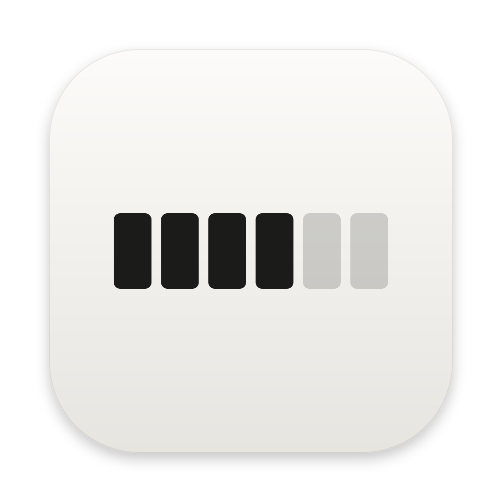
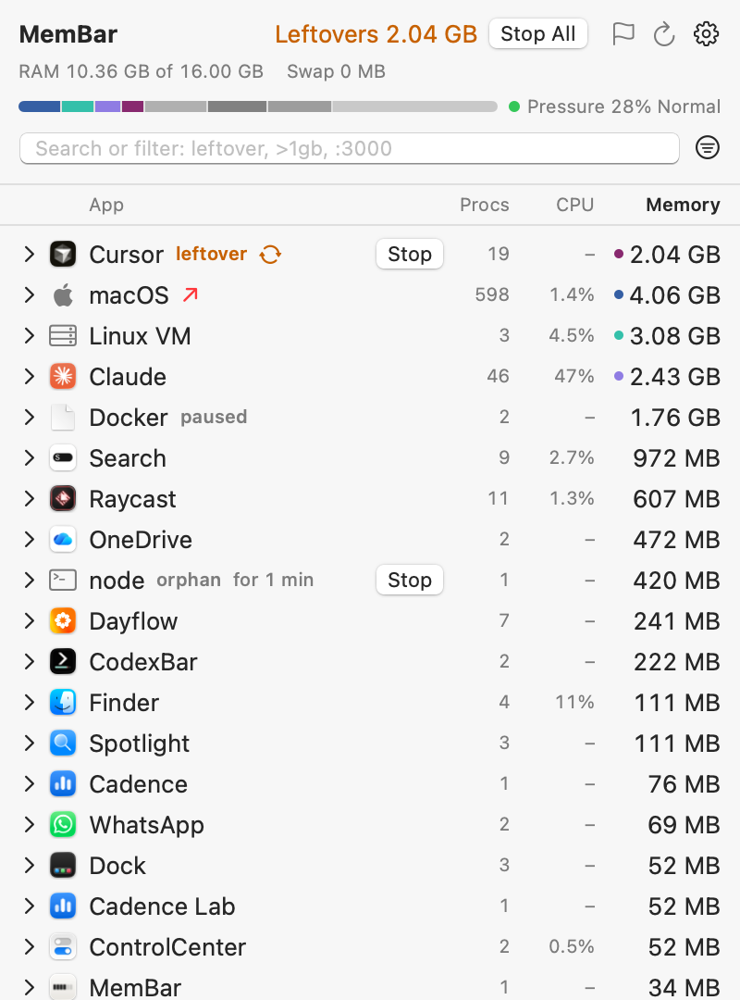

<p align="center"></p>

# MemBar

See the memory of each Mac app in the menu bar, and stop the processes that quit apps leave behind.

Activity Monitor shows processes such as `node`, `Claude Helper` or `com.apple.WebKit.WebContent`. It does not show which app owns them. When an app quits, some of its processes can continue to run and use RAM. On the first test Mac (16 GB), MemBar found about 5.5 GB of this waste:

- 19 Cursor processes (2.1 GB) that continued to run after Cursor quit.
- A headless iOS simulator (3.2 GB) that an agent started and did not shut down.

**Status:** v0.1.2, pre-1.0. One person makes it. The app is signed with a Developer ID and notarized by Apple. It is not sandboxed (see [Privacy and data](#privacy-and-data)). Some actions are not yet tested by a person on real apps, for example the rules over many hours.

<p align="center"></p>

## Highlights

- **Memory per app, not per process.** MemBar puts each helper, agent and dev server in the group of the app that owns it. For example, "Claude" is its window, its helpers and the `claude` agent processes that it started.
- **Leftovers, with one Stop button.** A leftover is a group whose app is not open. Stop ends its processes. For the iOS Simulator, Stop shuts down the booted devices.
- **Orphans and respawns.** MemBar finds dev servers and MCP servers that a closed terminal or agent left behind. It also marks a leftover that comes back after Stop, and it shows the launch agent that starts it again.
- **A RAM meter in the menu bar.** 6 blocks show the RAM in use. The panel shows memory pressure, a RAM bar, a 24-hour history and the change since a mark.
- **Rules, all off by default.** Auto-stop leftovers, Quit When Idle, Restart When Above a limit, Pause When in Background, and alerts.
- **Light and local.** Native Swift with no third-party packages and no network connection. It uses about 40 MB of RAM and almost 0% CPU when the panel is closed.

## Install

You need macOS 14 or later.

### Download

1. Download `MemBar-0.1.2.dmg` from [Releases](https://github.com/Aaditya2605/appmem/releases/latest).
2. Open the DMG, then drag MemBar to Applications.
3. Open MemBar from Applications. It shows in the menu bar, not in the Dock.

The DMG is for Macs with Apple silicon. On an Intel Mac, build from source.

### Build from source

You need Xcode 16 or later (Swift 6).

```bash
git clone https://github.com/Aaditya2605/appmem.git
cd appmem
./build.sh
open build/MemBar.app
```

`build.sh` makes a release build in `build/MemBar.app` and signs it ad hoc. Use `./build.sh debug` for a debug build.

## Use it

1. Click the blocks in the menu bar to open the panel.
2. Find the leftovers at the top of the list. They have an orange "leftover" label.
3. Click **Stop** on a leftover, or **Stop All** in the header.
4. Right-click a group for more actions: Quit, Restart, Pause, Reveal in Finder, rules and alerts.
5. Right-click the menu bar item for the quick menu: RAM, Stop All Leftovers, Copy Report.

To learn each label in the list, open the gear menu, then choose **What the Badges Mean**. Settings > Menu Bar Shows adds text next to the blocks: leftover size, RAM used or memory pressure.

## Core concepts

| Term | Meaning |
| --- | --- |
| Group | All the processes that work for one app. |
| Owner | The app that a process works for. MemBar uses the macOS "responsible" process (as Activity Monitor does), then the parent chain, then the program path. |
| Leftover | A group that belongs to an app, while that app is not open. Also a booted simulator while Simulator.app is not open, and a group whose processes all run a deleted program file (for example, an uninstalled brew service). |
| Orphan | A command-line process of yours (dev server, watcher, MCP server) that lost its terminal or agent. It is not a leftover unless you set it in Settings. |
| Memory | The physical footprint, as the "Memory" column in Activity Monitor. It includes compressed memory. |

[CONTEXT.md](CONTEXT.md) has the full rules for each term.

## What MemBar never stops

- Processes in the "macOS" group, launchd, and MemBar itself.
- Processes that other users own. The app and `--stop` do not run as root.
- Apple's own programs, except inside the group of a third-party app.
- A virtual machine group (Docker, OrbStack, Lima, UTM) is never a leftover, so Stop and the rules do not act on it. Stop could cut a VM off while it writes.

Rules that act without a click are off until you set them. Stop sends SIGTERM to each process. After 3 seconds, it sends SIGKILL to the processes that still run. The simulator gets `xcrun simctl shutdown`, not a signal.

## Command line

The app is also a command-line tool for scripts and agent hooks:

```bash
/Applications/MemBar.app/Contents/MacOS/MemBar --leftovers
```

| Flag | What it does |
| --- | --- |
| `--list` | Show the groups as text. |
| `--json [--cpu]` | Show groups, RAM, swap and pressure as JSON. `--cpu` adds CPU %. |
| `--leftovers` | Show one leftover on each line. Exit 1 if there are leftovers. |
| `--stop [NAME ...] [--dry-run]` | Stop all leftovers, or only the named ones. |
| `--test` | Run the self-check of the rules. It prints `ok`. |

Run `--help` for all the flags. The URLs `appmem://open`, `appmem://refresh` and `appmem://report` open the panel, scan again or copy a Markdown report. No URL stops a process.

## Privacy and data

- MemBar does not connect to the network. It reads process data with system calls and a few local tools (`top`, `launchctl`, `xcrun simctl`, `docker stats`).
- The 24-hour history is in `~/Library/Application Support/AppMem/history.json`. It grows by about 100 KB each day and keeps only 24 hours.
- Settings, rules and the mark are in the app's user defaults (`com.huetic.membar`).
- Inspect > Environment hides values whose names look secret until you click Show Values.
- MemBar is not sandboxed, because the App Sandbox blocks process inspection and signals. For this reason, it cannot be in the Mac App Store.

## Limitations

- A build from source is signed ad hoc, so it runs only on the Mac that built it.
- "Open" is a loose name match by whole words. An app with an unusual process name can look like a leftover. Right-click > Never Flag stops this.
- Chromium tabs show only "Renderer", not the site.
- Power is CPU energy only. It is not Activity Monitor's Energy Impact.
- If MemBar crashes, the apps that it paused stay paused. Click Resume on the row, or run `kill -CONT <pid>`.
- An app that quit before MemBar started is not known as an owner.

## Development

[CONTEXT.md](CONTEXT.md) is the spec: the terms, the rules and the decisions. Read it before you change the code.

```bash
swift build
.build/debug/MemBar --test
.build/debug/MemBar --snapshot panel.png
```

`./dmg.sh` makes the release DMG. Debug builds can draw the panel to a PNG with `--snapshot`. Add `CROWD=1` for made-up groups with each label, or `DARK=1` for dark mode. `build.sh` lists all the snapshot options.

Open an [issue](https://github.com/Aaditya2605/appmem/issues) for bugs and ideas.

## License

[MIT](LICENSE) © 2026 Aaditya Gaur
